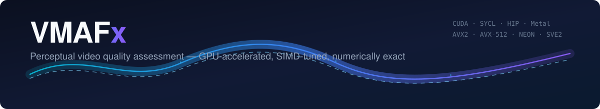

<!-- markdownlint-disable MD013 MD023 MD033 MD036 MD041 -->
<!-- A centred header needs inline HTML, a banner image, indented headings and
     badge lines past 80 columns, so those five rules are off for this file.
     Same directive style as docs/adr/0000-template.md. The prose below still
     wraps at 80. -->
<div align="center">

  

  **Perceptual video quality assessment — GPU-accelerated, SIMD-tuned, numerically exact**

  *A fork of [Netflix/vmaf](https://github.com/Netflix/vmaf) that keeps the reference scores byte-for-byte*

  [](https://github.com/VMAFx/vmafx/actions/workflows/tests-and-quality-gates.yml)
  [](https://github.com/VMAFx/vmafx/actions/workflows/libvmaf-build-matrix.yml)
  [](https://github.com/VMAFx/vmafx/actions/workflows/lint-and-format.yml)
  [](https://github.com/VMAFx/vmafx/actions/workflows/security-scans.yml)
  [](https://github.com/VMAFx/vmafx/actions/workflows/ffmpeg-integration.yml)
  [](https://github.com/VMAFx/vmafx/actions/workflows/go-ci.yml)
  [](https://github.com/VMAFx/vmafx/actions/workflows/rust-ci.yml)

  [](https://scorecard.dev/viewer/?uri=github.com/VMAFx/vmafx)
  [](AGENTS.md)
  [](docs/principles.md)
  [](CONTRIBUTING.md)

  [](docs/principles.md)
  [](docs/principles.md)
  [](go.mod)
  [](bindings/rust/vmafx-sys/Cargo.toml)
  [](pyproject.toml)

  [](docs/backends/cuda/overview.md)
  [](docs/backends/hip/overview.md)
  [](docs/backends/sycl/overview.md)
  [](docs/backends/metal/index.md)
  [](docs/backends/index.md)

  [](https://github.com/VMAFx/vmafx/tags)
  [](docs/usage/ffmpeg.md)
  [](docs/adr/1250-eupl-fork-relicense.md)
  [](https://ko-fi.com/lusoris)

  **[📖 Full documentation](https://vmafx.github.io/vmafx/)** · [Documentation source](docs/index.md)

</div>

---

## 🎯 Why VMAFx

VMAFx keeps upstream's numbers and adds the parts a production pipeline needs. The
three Netflix reference pairs are a required CI gate, so every change below is
measured against scores that never move.

| | Upstream `libvmaf` | VMAFx |
| --- | --- | --- |
| **GPU backends** | CUDA | CUDA · SYCL · HIP · Metal, selected at runtime |
| **SIMD** | AVX2, AVX-512 | AVX2 · AVX-512 · NEON · SVE2, held to feature-specific parity tolerances |
| **Output precision** | `%.6f` | `%.6f` by default, `--precision=max` for IEEE-754 round-trip |
| **Model surface** | `.json` / `.pkl` | plus ONNX tiny models with a signed registry |
| **Integrations** | FFmpeg filter | FFmpeg, an MCP server, a Kubernetes operator, Go and Rust bindings |
| **Numerical contract** | — | cross-backend parity is a gate, not a promise |

## 🚀 Get started

Follow the [installation and source-build guide](docs/getting-started/index.md)
for your platform. For a container workflow, see [Docker](docs/usage/docker.md).

After installation, compare a matching reference and distorted Y4M pair:

```sh
vmaf --reference reference.y4m --distorted distorted.y4m --json --output scores.json
```

Raw YUV needs its geometry spelled out, and a GPU backend is one flag:

```sh
vmaf --reference ref.yuv --distorted dis.yuv \
     --width 1920 --height 1080 --pixel_format 420 --bitdepth 8 \
     --backend cuda --feature cambi --json --output scores.json
```

See the [CLI reference](docs/usage/cli.md) for model selection, backend selection
and output options. For compressed inputs such as MP4, use
[FFmpeg integration](docs/usage/ffmpeg.md).

## 🧩 Backends at a glance

Every GPU-backed feature extractor has at least one device twin, and each twin
is held to the CPU reference by the cross-backend parity gate. The coverage
matrix below distinguishes those extractors from CPU-only metrics.

| Backend | Selected with | Notes |
| --- | --- | --- |
| CPU | `--backend cpu` | scalar reference; SIMD paths dispatch automatically |
| CUDA | `--backend cuda` | NVIDIA, CUDA 13.3 |
| SYCL | `--backend sycl` | Intel oneAPI; fp64-free device contract |
| HIP | `--backend hip` | AMD ROCm 10.0 |
| Metal | `--backend metal` | Apple Silicon, Apple Family 7 and later |

See [GPU and SIMD backends](docs/backends/index.md) for feature coverage per
backend and the tolerances the gate enforces.

## 📚 Guides and reference

| Task | Documentation |
| --- | --- |
| Score videos and choose output formats | [CLI reference](docs/usage/cli.md) |
| Use VMAFx in FFmpeg | [FFmpeg guide](docs/usage/ffmpeg.md) |
| Select hardware and check feature coverage | [GPU and SIMD backends](docs/backends/index.md) |
| Choose metrics and extractor options | [Feature reference](docs/metrics/features.md) |
| Choose a scoring model | [Models](docs/models/overview.md) |
| Embed libvmaf in an application | [C API](docs/api/index.md) |
| Train and run ONNX quality models | [Tiny AI](docs/ai/index.md) |
| Connect scoring tools through MCP | [MCP servers](docs/mcp/index.md) |

Build requirements, backend limitations and model defaults live in these
guides so they can be maintained alongside their implementations.

## 🤝 Contribute

Start with [CONTRIBUTING.md](CONTRIBUTING.md) for setup, required checks and
pull-request expectations. The [engineering principles](docs/principles.md)
cover coding and numerical-correctness standards; the
[repository guide](docs/architecture/index.md) explains the source layout.

- [Report a bug or request a feature](https://github.com/VMAFx/vmafx/issues)
- [Security reporting policy](SECURITY.md)
- [Support development](https://ko-fi.com/lusoris)

## 📈 Project status

- [Roadmap and release goals](docs/roadmap.md)
- [Releases and downloads](https://github.com/VMAFx/vmafx/releases)
- [Changelog](CHANGELOG.md)
- [Release process](docs/development/release.md)

## Upstream and license

VMAFx builds on [Netflix/vmaf](https://github.com/Netflix/vmaf).
See [upstream releases](https://github.com/Netflix/vmaf/releases) for Netflix's
release history.

The repository carries two sets of terms, separated by provenance and recorded
per file as an `SPDX-License-Identifier`
([ADR-1250](docs/adr/1250-eupl-fork-relicense.md)):

- **Code inherited, ported or translated from Netflix/vmaf or another project**
  keeps the terms it already carries — [BSD-2-Clause-Patent](LICENSE) for
  Netflix's code, and its own licence for the libjxl, Xiph and IQA code the fork
  builds on. Those files carry the original copyright notice.
- **Fork-authored code** is licensed under [EUPL-1.2](LICENSES/EUPL-1.2.txt), a
  reciprocal licence.

**What that means in practice**: because the shipped `libvmaf` links both
together, redistributing a modified library obliges you to offer its source under
EUPL-1.2. If you need permissive terms, use
[Netflix/vmaf](https://github.com/Netflix/vmaf) upstream, which is unaffected.
The per-file tags are authoritative; this paragraph is a summary.

## Standards & Governance

This repository conforms to High-Integrity Systems Standards (HISS-21)
and modernized NASA JPL Power-of-10 rules.

<!-- praetor:readme-governance:start -->
Praetor manages this repository's declared governance policy. This managed block records adoption state; it is not a verification certificate.

| Gate | Command | Contract |
| :--- | :--- | :--- |
| **Verification** | `make verify-all` | Runs the repository's configured verification cascade |
| **HISS Audit** | `praetorctl audit` | Enforces policy, generated-surface integrity, and the debt ratchet |
| **Context Sync** | `praetorctl compile-context --verify` | Verifies every generated agent context against `AGENTS.md` |
| **Debt Baseline** | `.standards-baseline.json` | 268 recorded infractions; audit forbids growth |
<!-- praetor:readme-governance:end -->
