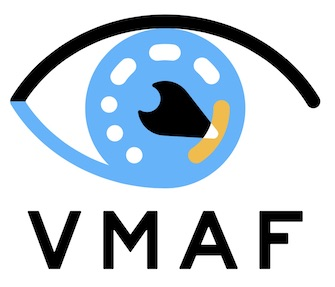

# VMAFx

<!-- Build / test / security CI badges (live status) -->
[](https://github.com/VMAFx/vmafx/actions/workflows/tests-and-quality-gates.yml)
[](https://github.com/VMAFx/vmafx/actions/workflows/lint-and-format.yml)
[](https://github.com/VMAFx/vmafx/actions/workflows/security-scans.yml)
[](https://github.com/VMAFx/vmafx/actions/workflows/libvmaf-build-matrix.yml)
[](https://github.com/VMAFx/vmafx/actions/workflows/ffmpeg-integration.yml)
[](https://github.com/VMAFx/vmafx/actions/workflows/rust-ci.yml)
[](https://github.com/VMAFx/vmafx/actions/workflows/go-ci.yml)

<!-- Hardware capability badges -->
[](docs/backends/)
[](docs/backends/)

<!-- Distribution / governance badges -->
[](https://github.com/orgs/VMAFx/packages)
[](LICENSE)
[](https://www.conventionalcommits.org)
[](https://securityscorecards.dev/viewer/?uri=github.com/VMAFx/vmafx)
[](https://ko-fi.com/lusoris)



**VMAFx** is a high-performance, GPU-accelerated, full-precision fork of
[Netflix/vmaf](https://github.com/Netflix/vmaf) — perceptual video quality
assessment, Emmy-winning, production-hardened, and expanded with multi-vendor
hardware acceleration and modern quality metrics.

Upstream Netflix/vmaf remains the authoritative standard for the scoring
algorithm. VMAFx preserves this contract without compromise: the three
Netflix CPU reference test pairs run as an inviolable golden gate on every PR.
Around this core, the fork adds native GPU execution, SIMD vectorized paths,
expanded metrics, full-precision output, lightweight AI inference, and signed
releases.

---

## Why VMAFx? (Key Differences)

Compared to upstream Netflix/vmaf, VMAFx provides:

- **Multi-Vendor GPU Acceleration**:
  - **CUDA**: NVIDIA RTX and datacenter GPUs with optimized kernel fusion and
    asynchronous stream execution.
  - **SYCL / oneAPI**: Portable cross-vendor acceleration (Intel Arc/Xe,
    NVIDIA, AMD via Codeplay), including an fp64-less device fallback path for
    Intel consumer GPUs.
  - **HIP (AMD ROCm ≥ 7)**: 19 registered native device kernels for AMD
    Radeon and Instinct hardware.
  - **Metal (Apple Silicon)**: 17 native device kernels covering all primary
    feature extractors on macOS.
- **Modern SIMD Paths**: Production AVX2, AVX-512, ARM NEON, and SVE2
  vectorized routines across hot feature extractors.
- **Extended Metric Suite**:
  - Classic standards: VMAF, VMAF-NEG, CAMBI, PSNR, SSIM, MS-SSIM, VIF, ADM.
  - Fork additions: **ΔE-ITP** (`delta_e_itp`, HDR/WCG color difference),
    **PU21** (`pu21`, perceptually uniform transfer for HDR), **NIQE** and
    **BRISQUE** (no-reference quality metrics), and **Y-FUNQUE+**
    (`y_funque_plus`, unified video quality assessment).
- **Full-Precision Output (`--precision`)**: Default `%.6f` matches upstream
  Netflix formatting; `--precision=max` (or integer `1..17`) opts in to
  `%.17g` IEEE-754 round-trip lossless scores.
- **Tiny-AI Surface (ONNX Runtime)**: Lightweight ONNX quality regressors and
  neural pre-filters integrated directly into libvmaf, executable across CPU,
  CUDA, ROCm, OpenVINO, and CoreML.
- **FFmpeg Integration**: Patches against FFmpeg `n9.0.1` supporting GPU
  backends (`--enable-libvmaf-{cuda,sycl,hip}`) and tiny-AI filters.
- **Clean Symbol Boundary**: `libvmaf.so` strictly exports only 44 `vmaf_*`
  public symbols with zero leaked internal library symbols.
- **Signed Releases**: Releases use SemVer, signed with Sigstore keyless OIDC,
  accompanied by SPDX and CycloneDX SBOMs and SLSA Level 3 provenance.

---

## Quickstart

### Automated Environment Setup

Use the cross-platform setup script to install dependencies:

```bash
# Auto-detects Ubuntu, Debian, Arch, Fedora, Alpine, macOS, and Windows
./scripts/setup/detect.sh
```

Pre-built multi-arch container images are also available:

```bash
docker pull ghcr.io/vmafx/vmafx:latest
```

### Building from Source

The build system uses Meson and Ninja. Note that the build root is `core/`:

```bash
# CPU-only build and test
meson setup build core -Denable_cuda=false -Denable_sycl=false
ninja -C build
meson test -C build
```

To enable GPU backends during configuration:

- **CUDA**: `meson setup build core -Denable_cuda=true` (requires CUDA Toolkit)
- **SYCL**: `meson setup build core -Denable_sycl=true` (requires oneAPI `icpx`)
- **HIP**: `meson setup build core -Denable_hip=true -Denable_hipcc=true`
  (requires ROCm ≥ 7)
- **Metal**: `meson setup build core -Denable_metal=enabled` (macOS)

---

## Scoring Video

Use the `vmaf` command-line tool to score video files:

### Basic Scoring

```bash
# Score Y4M files (model defaults to vmaf_v0.6.1)
build/tools/vmaf -r reference.y4m -d distorted.y4m

# Score raw YUV (1080p, 8-bit, 4:2:0) with full precision JSON output
build/tools/vmaf -r reference.yuv -d distorted.yuv \
                 -w 1920 -h 1080 -p 420 -b 8 \
                 -m version=vmaf_v0.6.1 --precision=max \
                 --json -o scores.json
```

### Selecting a GPU Backend

Use `--backend` to explicitly direct execution to specific hardware:

```bash
# Explicit GPU selection
build/tools/vmaf -r ref.y4m -d dis.y4m --backend cuda
# Other options: --backend sycl | hip | metal | cpu
```

### Extracting Additional Metrics

Enable additional metrics with `--feature`:

```bash
# Run CAMBI, NIQE, BRISQUE, and ΔE-ITP
build/tools/vmaf -r ref.y4m -d dis.y4m \
                 --feature cambi \
                 --feature niqe \
                 --feature brisque \
                 --feature delta_e_itp
```

---

## Backends at a Glance

| Backend | Status | Notes |
| ------- | ------ | ----- |
| **CPU** | Production | AVX2, AVX-512, ARM NEON, SVE2. Inviolable golden-data reference. |
| **CUDA** | Production | NVIDIA RTX/datacenter GPUs (`nvcc`, CUDA 13). Async stream execution. |
| **SYCL** | Production | oneAPI DPC++; Intel Arc/Xe, NVIDIA, AMD. Includes fp64-less fallback. |
| **HIP** | Production | 19 registered native device kernels for AMD ROCm ≥ 7. |
| **Metal** | Production | 17 registered native device kernels on Apple Silicon (macOS). |

Cross-backend numerical variance is verified in CI to maintain strict numerical
parity with CPU reference scores. See
[cross-backend gate documentation](docs/development/cross-backend-gate.md).

---

## Roadmap & Milestones

VMAFx plans and releases are tracked publicly:

- **Roadmap Overview**: See [`docs/roadmap.md`](docs/roadmap.md) for sequenced
  release goals and release gating criteria.
- **GitHub Milestones**: Track progress in
  [Milestones](https://github.com/VMAFx/vmafx/milestones).
- **Public Board**: View in-flight work on the
  [VMAFx Project Board](https://github.com/orgs/VMAFx/projects/1).

Key milestones:

- **1.0.0**: First release — correctness, release pipeline, tiny-AI, and
  model retraining pass.
- **1.1**: Expanded metrics (ΔE-ITP, PU21, NIQE, BRISQUE, Y-FUNQUE+) and
  GPU twins.
- **1.2 & 1.3**: Cloud-native foundations, server mode, containers, and
  Kubernetes multi-vendor GPU orchestration.
- **2.0**: Modernization across Go tools, Rust pilot extractors, and C++23.

---

## Documentation

The rendered documentation site is at **<https://vmafx.github.io/vmafx/>**
(built from `docs/` by `mkdocs`; `site_url` in `mkdocs.yml` is the source of
truth for that address). The same content, browsable in-tree, lives under
[`docs/`](docs/):

- **Engineering & Standards**:
  - [`docs/principles.md`](docs/principles.md) — NASA Power-of-10, JPL, CERT,
    MISRA coding standards, and Netflix golden gate policy.
  - [`docs/roadmap.md`](docs/roadmap.md) — Project milestones and release gates.
- **Hardware Backends & Gate**:
  - [`docs/backends/`](docs/backends/) — Architecture and acceleration guides
    for CUDA, SYCL, HIP, Metal, and SIMD.
  - [`docs/development/cross-backend-gate.md`](docs/development/cross-backend-gate.md)
    — Cross-backend numeric tolerance matrix.
- **Metrics Reference**:
  - [`docs/metrics/`](docs/metrics/) — Guides for CAMBI, SSIMULACRA 2,
    ΔE-ITP, PU21, NIQE, BRISQUE, Y-FUNQUE+, and CTC testing.
- **Machine Learning & Server**:
  - [`docs/ai/`](docs/ai/) — Tiny-AI model architecture, training, and ONNX
    Runtime inference.
  - [`docs/mcp/`](docs/mcp/) — Standalone and embedded Model Context Protocol
    (MCP) server interfaces.
- **Developer Orientation**:
  - [`CLAUDE.md`](CLAUDE.md) / [`AGENTS.md`](AGENTS.md) — Agent and developer
    workflows.
  - [`CONTRIBUTING.md`](CONTRIBUTING.md) — Contribution workflow and testing.
  - [`SECURITY.md`](SECURITY.md) — Security policy and vulnerability disclosure.

---

## Attribution & License

- **Upstream Project**: [Netflix/vmaf](https://github.com/Netflix/vmaf).
  The VMAF algorithm, scoring methodology, and reference test datasets
  remain the intellectual property of Netflix.
- **License**: [BSD-2-Clause-Patent](LICENSE) — preserved from upstream
  Netflix/vmaf. Fork additions are licensed under identical terms.
- **Maintainers**: Co-authored by [Lusoris](https://github.com/Lusoris)
  and Anthropic Claude.

---

## Support the Fork

If VMAFx saves you compute time or GPU hardware costs, consider supporting
rig maintenance and test hardware at [ko-fi.com/lusoris](https://ko-fi.com/lusoris).

For release history and upstream updates, see [`CHANGELOG.md`](CHANGELOG.md)
and [Netflix/vmaf Releases](https://github.com/Netflix/vmaf/releases).
