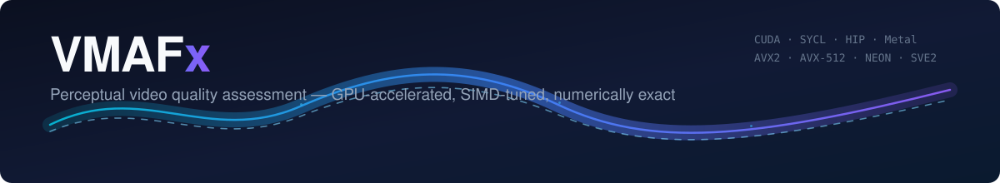

<!-- markdownlint-disable MD013 MD023 MD033 MD036 MD041 -->
<!-- A centred header needs inline HTML, a banner image, indented headings and
     badge lines past 80 columns, so those five rules are off for this file.
     Same directive style as docs/adr/0000-template.md. The prose below still
     wraps at 80. -->
<div align="center">

  

  **Perceptual video quality assessment — GPU-accelerated, SIMD-tuned, numerically exact**

  *A fork of [Netflix/vmaf](https://github.com/Netflix/vmaf) that keeps the reference scores byte-for-byte*

  [](https://github.com/VMAFx/vmafx/actions/workflows/tests-and-quality-gates.yml)
  [](https://github.com/VMAFx/vmafx/actions/workflows/libvmaf-build-matrix.yml)
  [](https://github.com/VMAFx/vmafx/actions/workflows/lint-and-format.yml)
  [](https://github.com/VMAFx/vmafx/actions/workflows/security-scans.yml)
  [](https://github.com/VMAFx/vmafx/actions/workflows/ffmpeg-integration.yml)
  [](https://github.com/VMAFx/vmafx/actions/workflows/go-ci.yml)
  [](https://github.com/VMAFx/vmafx/actions/workflows/rust-ci.yml)

  [](https://scorecard.dev/viewer/?uri=github.com/VMAFx/vmafx)
  [](https://www.bestpractices.dev/projects/14549)
  [](AGENTS.md)
  [](docs/principles.md)
  [](CONTRIBUTING.md)

  [](docs/principles.md)
  [](docs/principles.md)
  [](go.mod)
  [](bindings/rust/vmafx-sys/Cargo.toml)
  [](pyproject.toml)

  [](docs/backends/cuda/overview.md)
  [](docs/backends/hip/overview.md)
  [](docs/backends/sycl/overview.md)
  [](docs/backends/metal/index.md)
  [](docs/backends/index.md)

  [](https://github.com/VMAFx/vmafx/releases)
  [](docs/usage/ffmpeg.md)
  [](docs/adr/1250-eupl-fork-relicense.md)
  [](https://ko-fi.com/lusoris)

  **[📖 Full documentation](https://vmafx.dev/)** · [Documentation source](docs/index.md)

</div>

---

## 🎯 Why VMAFx

VMAFx keeps upstream's numbers and adds the parts a production pipeline needs. The
three Netflix reference pairs are a required CI gate, so every change below is
measured against scores that never move.

| | Upstream `libvmaf` | VMAFx |
| --- | --- | --- |
| **GPU backends** | CUDA | CUDA · SYCL · HIP · Metal, selected at runtime |
| **SIMD** | AVX2, AVX-512 | AVX2 · AVX-512 · NEON · SVE2, held to feature-specific parity tolerances |
| **Output precision** | `%.6f` | `%.6f` by default, `--precision=max` for IEEE-754 round-trip |
| **Model surface** | `.json` / `.pkl` | plus ONNX tiny models with a signed registry |
| **Integrations** | FFmpeg filter | FFmpeg, an MCP server, a Kubernetes operator, Go and Rust bindings |
| **Numerical contract** | — | cross-backend parity is a gate, not a promise |

## 🚀 Get started

Follow the [installation and source-build guide](docs/getting-started/index.md)
for your platform. For a container workflow, see [Docker](docs/usage/docker.md).

After installation, compare a matching reference and distorted Y4M pair:

```sh
vmaf --reference reference.y4m --distorted distorted.y4m --json --output scores.json
```

Raw YUV needs its geometry spelled out, and a GPU backend is one flag:

```sh
vmaf --reference ref.yuv --distorted dis.yuv \
     --width 1920 --height 1080 --pixel_format 420 --bitdepth 8 \
     --backend cuda --feature cambi --json --output scores.json
```

See the [CLI reference](docs/usage/cli.md) for model selection, backend selection
and output options. For compressed inputs such as MP4, use
[FFmpeg integration](docs/usage/ffmpeg.md).

## 🧩 Backends at a glance

Every GPU-backed feature extractor has at least one device twin, and each twin
is held to the CPU reference by the cross-backend parity gate. The coverage
matrix below distinguishes those extractors from CPU-only metrics.

| Backend | Selected with | Notes |
| --- | --- | --- |
| CPU | `--backend cpu` | scalar reference; SIMD paths dispatch automatically |
| CUDA | `--backend cuda` | NVIDIA, CUDA 13.4 |
| SYCL | `--backend sycl` | Intel oneAPI; fp64-free device contract |
| HIP | `--backend hip` | AMD ROCm 10.1 |
| Metal | `--backend metal` | Apple Silicon, Apple Family 7 and later |

See [GPU and SIMD backends](docs/backends/index.md) for feature coverage per
backend and the tolerances the gate enforces.

## 📚 Guides and reference

| Task | Documentation |
| --- | --- |
| Score videos and choose output formats | [CLI reference](docs/usage/cli.md) |
| Use VMAFx in FFmpeg | [FFmpeg guide](docs/usage/ffmpeg.md) |
| Select hardware and check feature coverage | [GPU and SIMD backends](docs/backends/index.md) |
| Choose metrics and extractor options | [Feature reference](docs/metrics/features.md) |
| Choose a scoring model | [Models](docs/models/overview.md) |
| Embed libvmaf in an application | [C API](docs/api/index.md) |
| Train and run ONNX quality models | [Tiny AI](docs/ai/index.md) |
| Connect scoring tools through MCP | [MCP servers](docs/mcp/index.md) |

Build requirements, backend limitations and model defaults live in these
guides so they can be maintained alongside their implementations.

## 🤝 Contribute

Start with [CONTRIBUTING.md](CONTRIBUTING.md) for setup, required checks and
pull-request expectations. The [engineering principles](docs/principles.md)
cover coding and numerical-correctness standards; the
[repository guide](docs/architecture/index.md) explains the source layout.

- [Report a bug or request a feature](https://github.com/VMAFx/vmafx/issues)
- [Ask a question](https://github.com/VMAFx/vmafx/discussions) or read
  [how to get support](SUPPORT.md)
- [Code of conduct](CODE_OF_CONDUCT.md)
- [Accessibility](ACCESSIBILITY.md)
- [Security reporting policy](SECURITY.md)
- [Support development](docs/support-vmafx.md)

## 💖 Support VMAFx

VMAFx is free and stays open source. Sponsor it on
[GitHub Sponsors](https://github.com/sponsors/lusoris) (USD) or
[Ko-fi](https://ko-fi.com/lusoris) or
[Patreon](https://www.patreon.com/Lusoris) (EUR) to pay for CI and cloud GPU
test time. Sponsors are thanked by tier in
[SPONSORS.md](SPONSORS.md); [Support VMAFx](docs/support-vmafx.md) explains
what it pays for.

## 📈 Project status

- [Roadmap and release goals](docs/roadmap.md)
- [Releases and downloads](https://github.com/VMAFx/vmafx/releases)
- [Changelog](CHANGELOG.md)
- [Release process](docs/development/release.md)

## Upstream and license

VMAFx builds on [Netflix/vmaf](https://github.com/Netflix/vmaf).
See [upstream releases](https://github.com/Netflix/vmaf/releases) for Netflix's
release history.

Each file's `SPDX-License-Identifier` header says which licence applies to it
([ADR-1250](docs/adr/1250-eupl-fork-relicense.md)). The files at the repository
root hold the texts ([ADR-1699](docs/adr/1699-root-licence-files-eupl.md)):

| Code | Licence | Text |
| --- | --- | --- |
| Written by the fork | EUPL-1.2, a reciprocal licence | [`LICENSE`](LICENSE) |
| Inherited, ported or translated from Netflix/vmaf | BSD-2-Clause-Patent, with Netflix's copyright notice | [`NOTICE`](NOTICE) |
| Carried from libjxl, Xiph, IQA and other projects | that project's licence, with its notice in the file | [`LICENSES/`](LICENSES/) |

**What that means in practice**: the shipped `libvmaf` links both together.
Distributing it, modified or not, obliges you to provide its source or point to
a repository that has it (EUPL-1.2, Article 5). A modified library is
distributed under EUPL-1.2. If you need permissive terms, use
[Netflix/vmaf](https://github.com/Netflix/vmaf) upstream, which is unaffected.
The per-file tags are authoritative; this section is a summary, not legal
advice. [Licensing](docs/licensing.md) lists what each published package
carries, and [Embedding VMAFx in another product](docs/licensing.md#embedding-vmafx-in-another-product)
goes through linking, modification and network use. [Credits](docs/credits.md)
names every third-party project, model, dataset, paper and tool VMAFx builds on.

## Standards & Governance

This repository conforms to High-Integrity Systems Standards (HISS-21)
and modernized NASA JPL Power-of-10 rules.

<!-- praetor:readme-governance:start -->
[![Documentation Governance][praetor-docs-badge]][praetor-docs-runs]

Praetor manages this repository's declared governance policy. This managed
block records adoption state; it is not a verification certificate.

**Verification**: `make verify-all` runs the repository's configured
verification cascade.

**HISS Audit**: `praetorctl audit` enforces policy, generated-surface
integrity, and the debt ratchet.

**Context Sync**: `praetorctl compile-context --verify` verifies every
generated agent context against `AGENTS.md`.

**Documentation**: `make docs-lint` enforces locked Markdown style and the
private scratch-link policy.

**Debt Baseline**: `.standards-baseline.json` anchors the debt ratchet at
0 recorded infractions; audit forbids growth.

[praetor-docs-badge]: https://github.com/vmafx/vmafx/actions/workflows/praetor-docs.yml/badge.svg
[praetor-docs-runs]: https://github.com/vmafx/vmafx/actions/workflows/praetor-docs.yml
<!-- praetor:readme-governance:end -->
