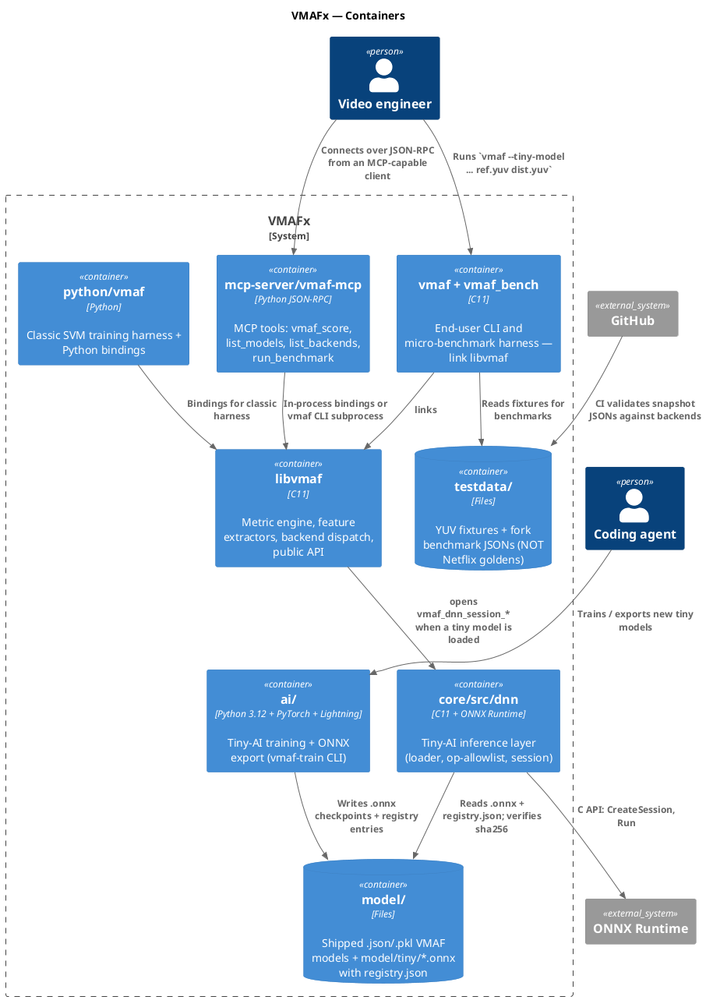

# C4 Level 2 — Container view

> **Status.** Stub. Scaffolded 2026-04-17 as part of the VMAFx alignment
> sweep. Fill in per-container interfaces and data flows as the fork's
> internal boundaries stabilise. See [c4-context.md](c4-context.md) for
> Level 1 and [index.md](index.md) for the on-disk repo map.

## Container diagram

## Containers

| Container | Language | Responsibility | AGENTS.md |
| --- | --- | --- | --- |
| libvmaf | C11 | Metric engine, feature extractors, backend dispatch, public API | [../../core/AGENTS.md](../../core/AGENTS.md) |
| core/src/dnn | C11 | Tiny-AI inference layer (loader + op-allowlist + ORT session) | [../../core/src/dnn/AGENTS.md](../../core/src/dnn/AGENTS.md) |
| core/src/feature | C11 + SIMD + CUDA + SYCL | Per-feature scalar + vector + GPU kernels | [../../core/src/feature/AGENTS.md](../../core/src/feature/AGENTS.md) |
| core/src/cuda | C + CUDA | CUDA backend runtime (picture, stream, ring buffer) | [../../core/src/cuda/AGENTS.md](../../core/src/cuda/AGENTS.md) |
| core/src/sycl | C++ + SYCL/DPC++ | SYCL backend runtime (USM, dmabuf) | [../../core/src/sycl/AGENTS.md](../../core/src/sycl/AGENTS.md) |
| core/tools | C11 | `vmaf` + `vmaf_bench` CLI binaries | [../../core/tools/AGENTS.md](../../core/tools/AGENTS.md) |
| core/test | C11 | C unit tests (µnit-style) | [../../core/test/AGENTS.md](../../core/test/AGENTS.md) |
| ai/ | Python + PyTorch + Lightning | Tiny-AI training + ONNX export (`vmaf-train` CLI) | [../../ai/AGENTS.md](../../ai/AGENTS.md) |
| mcp-server/vmaf-mcp | Python JSON-RPC | MCP tool surface | [../../mcp-server/AGENTS.md](../../mcp-server/AGENTS.md) |
| python/vmaf | Python | Classic SVM harness + bindings + golden-data tests | [../../python/vmaf/AGENTS.md](../../python/vmaf/AGENTS.md) |
| model/ | Files | Shipped models (`.json`, `.pkl`, `.onnx` + registry.json) | n/a |
| testdata/ | Files | YUV fixtures + fork benchmark JSONs | n/a |

## Boundary invariants

1. **libvmaf is C-only** on the runtime path. Python and PyTorch are
   training-only and never linked into the shipped library.
2. **Training ↔ runtime boundary** is `.onnx` + sidecar JSON on disk.
   `ai/` and `core/src/dnn/` communicate only through files in
   `model/tiny/`. See [ADR-0021](../adr/0021-training-stack-pytorch-lightning.md)
   and [ADR-0022](../adr/0022-inference-runtime-onnx.md).
3. **Untrusted ONNX input** — every `.onnx` loaded via `--tiny-model` is
   scanned for banned ops before `CreateSession` is called. See
   [ADR-0039](../adr/0039-onnx-runtime-op-walk-registry.md).
4. **Backend dispatch at runtime** — the CPU / CUDA / SYCL selection is
   per-invocation, not per-build (backends must all be enabled at build
   time to be selectable at runtime).

## Next levels

- **Level 3 — Component**: one diagram per container showing its internal
  modules. Add as components stabilise (starting with core/src/dnn since
  that is the newest, most active boundary).
- **Level 4 — Code**: generated on demand via `ctags` / clang AST, not
  hand-maintained.
