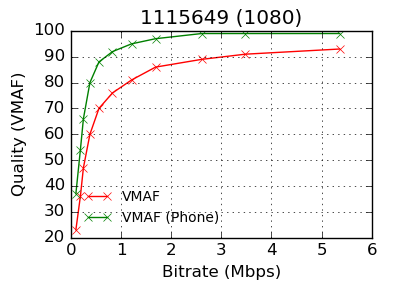

<!-- markdownlint-disable MD013 -->
# Models

The default model of this fork is `vmaf_v1.0.16_3d0h` (VMAF v1, a 1080p HDTV
model at 3H), selected whenever you pass no `--model`
([ADR-1169](../adr/1169-default-model-v1-0-16.md)). This page lists every
built-in model and explains the previous generation (v0, whose `vmaf_v0.6.1` is
the upstream Netflix default). VMAF v1 is documented in
[VMAF v1 (v1.0.16)](v1.md).

## Choose a model

| Scenario | Viewing condition | Model string (`--model version=...`) | File |
| --- | --- | --- | --- |
| Default (this fork) | 1080p HDTV at 3H | `vmaf_v1.0.16_3d0h` | `model/vmaf_v1.0.16/vmaf_v1.0.16_3d0h.json` |
| 1080p HDTV (upstream default) | 1080p HDTV at 3H | `vmaf_v0.6.1` | `model/vmaf_v0.6.1.json` |
| Phone | Phone screen | `vmaf_v0.6.1:enable_transform=true` (Python: `--phone-model`) | `model/vmaf_v0.6.1.json` |
| 4K TV | 4K at 1.5H | `vmaf_4k_v0.6.1` | `model/vmaf_4k_v0.6.1.json` |
| Compare encoders (NEG) | 1080p HDTV at 3H | `vmaf_v0.6.1neg` | `model/vmaf_v0.6.1neg.json` |
| Compare encoders (NEG) | 4K at 1.5H | `vmaf_4k_v0.6.1neg` | `model/vmaf_4k_v0.6.1neg.json` |
| Confidence interval | 1080p HDTV at 3H | `vmaf_b_v0.6.3` | `model/vmaf_b_v0.6.3.json` |
| v1 phone, 4K, HFR | see [VMAF v1](v1.md) | `vmaf_v1.0.16_*` | `model/vmaf_v1.0.16/`, `model/vmaf_v1.0.16_hfr/` |

Run a model with `--model version=NAME`, or with `--model path=FILE` for a file
on disk:

```bash
vmaf --reference ref.yuv --distorted dis.yuv \
     --width 576 --height 324 --pixel_format 420 --bitdepth 8 \
     --model version=vmaf_v0.6.1
```

On the Netflix `src01_hrc00_576x324.yuv` / `src01_hrc01_576x324.yuv` pair this
gives a pooled `vmaf` mean of 76.667831 with `vmaf_v0.6.1` and 82.816060 with
the default `vmaf_v1.0.16_3d0h` (at the default `%.6f` precision).

!!! note
    Upstream Netflix still defaults to `vmaf_v0.6.1`, so the same command gives
    different numbers on upstream and on this fork. Pin `--model
    version=vmaf_v0.6.1`, or pass `--netflix-compat` (CPU backend, `%.6f`
    precision and the v0.6.1 default model), when you need the old values.

## Built-in models

Every model below is compiled into libvmaf when `built_in_models` is true (the
default), so it can be selected by `version=` without a file path
(`core/src/model.c`). The default is `VMAF_DEFAULT_MODEL_VERSION`
(`vmaf_default_model_version()` in the C API); the compatibility model is
`VMAF_NETFLIX_COMPAT_MODEL_VERSION` (`vmaf_v0.6.1`), both in
`core/include/libvmaf/model.h`.

| Version string | Purpose |
| --- | --- |
| `vmaf_v1.0.16_3d0h` | v1, 1080p at 3H. The default of this fork. |
| `vmaf_v1.0.16_3d0h_2160` | v1, 4K at 3H, range [0, 110]. |
| `vmaf_v1.0.16_5d0h` | v1, phone (1080p at 5H). |
| `vmaf_v1.0.16_1d5h_2160` | v1, 4K at 1.5H. The 4K default. |
| `vmaf_v1.0.16_hfr_3d0h` | v1, 1080p at 3H, high-frame-rate (see [VMAF v1](v1.md#high-frame-rate-hfr-content)). |
| `vmaf_v1.0.16_hfr_3d0h_2160` | v1, 4K at 3H, high-frame-rate. |
| `vmaf_v1.0.16_hfr_5d0h` | v1, phone, high-frame-rate. |
| `vmaf_v1.0.16_hfr_1d5h_2160` | v1, 4K at 1.5H, high-frame-rate. |
| `vmaf_v0.6.1` | v0, 1080p HDTV at 3H; the upstream default and the `--netflix-compat` model. |
| `vmaf_4k_v0.6.1` | v0, 4K TV at 1.5H. |
| `vmaf_v0.6.1neg` | v0, 1080p, No Enhancement Gain. |
| `vmaf_4k_v0.6.1neg` | v0, 4K, No Enhancement Gain. |
| `vmaf_b_v0.6.3` | v0, bootstrap model with a confidence interval ([confidence interval](../metrics/confidence-interval.md)). |
| `vmaf_float_v0.6.1` | v0, floating-point feature variant of `vmaf_v0.6.1`. |
| `vmaf_float_v0.6.1neg` | v0, floating-point variant of the NEG model. |
| `vmaf_float_4k_v0.6.1` | v0, floating-point variant of the 4K model. |
| `vmaf_float_b_v0.6.3` | v0, floating-point bootstrap model. |

The four `vmaf_float_*` strings are built when floating-point features are
enabled (`enable_float`, the default). The residue-bootstrap models
(`model/vmaf_rb_v0.6.2/`, `model/vmaf_rb_v0.6.3/`, `model/vmaf_4k_rb_v0.6.2/`)
and the models under `model/other_models/` are not built in; load them with
`--model path=FILE`.

## Predict Quality on a 1080p HDTV screen at 3H

The v0 model `model/vmaf_v0.6.1.json` is trained to predict the quality of
videos displayed on a 1080p HDTV in a living-room-like environment. The
default model of this fork, `vmaf_v1.0.16_3d0h`, targets the same condition.

How the model was trained:

- **Viewing condition.** The distorted videos (with native resolutions of
  1080p, 720p, 480p and so on) were rescaled to 1080 resolution and shown on
  the 1080p display with a viewing distance of three times the screen height
  (3H), the critical distance for a viewer to appreciate 1080p resolution
  sharpness (see
  [recommendation](https://www.itu.int/dms_pubrec/itu-r/rec/bt/R-REC-BT.2022-0-201208-W!!PDF-E.pdf)).
- **Method.** Subjective data were collected in a lab experiment with the
  [absolute categorical rating (ACR)](https://en.wikipedia.org/wiki/Absolute_Category_Rating)
  methodology, except that after viewing a sequence a subject votes on a
  continuous scale (from "bad" to "excellent", with evenly spaced markers of
  "poor", "fair" and "good" in between) instead of the conventional five-level
  discrete scale.
- **Content.** Video clips selected from the Netflix catalog, each 10 seconds
  long. For each clip, a combination of 6 resolutions and 3 encoding
  parameters generates the processed sequences, resulting in 18 impairment
  conditions for testing.
- **Score mapping.** The raw subjective scores are cleaned up with the MLE
  methodology described in [SUREAL](https://github.com/Netflix/sureal). The
  aggregate scores are mapped to the VMAF scale, where "bad" is roughly 20 and
  "excellent" is 100.

## Predict Quality on a Cellular Phone Screen

The v0 model `model/vmaf_v0.6.1.json` has a companion phone-screen mode. From
the C CLI, set `enable_transform=true` on the model:

```bash
vmaf --reference src01_hrc00_576x324.yuv \
     --distorted src01_hrc01_576x324.yuv \
     --width 576 --height 324 --pixel_format 420 --bitdepth 8 \
     --model version=vmaf_v0.6.1:enable_transform=true
```

From the Python scripts:

```bash
python -m vmaf.script.run_vmaf yuv420p 576 324 \
    src01_hrc00_576x324.yuv \
    src01_hrc01_576x324.yuv \
    --phone-model
```

The model options the `vmaf` CLI recognises are `path`, `name`, `version`,
`disable_clip` and `enable_transform`. Any other key is read as a
`<feature>.<option>` overload (see [VMAF
v1](v1.md#specifying-encode-side-parameters)).
The v1 phone model is `vmaf_v1.0.16_5d0h`.

The subjective experiment uses similar video sequences as the default 1080p
HDTV model, except that they were watched on a cellular phone screen (Samsung
S5 with resolution 1920x1080). Each subject was instructed to view the video at
a distance he or she felt comfortable with, instead of a fixed viewing distance.
In the trained model, the score ranges from 0 to 100, linear with the
subjective voting scale, where roughly "bad" is mapped to score 20 and
"excellent" to 100.

Invoking the phone model generates VMAF scores higher than the regular model,
which is more suitable for laptop, TV and similar viewing conditions. An
example VMAF-bitrate relationship for the two models:



Because of screen size and viewing distance, the same distorted video is
perceived as having a higher quality on a phone screen than on a laptop or TV
screen. When the quality score reaches its maximum (100), further increasing the
encoding bitrate does not result in any perceptual improvement in quality.

## Predict Quality on a 4KTV Screen at 1.5H

A 4K VMAF model at `model/vmaf_4k_v0.6.1.json` predicts the subjective quality
of video displayed on a 4KTV and viewed from the distance of 1.5 times the
height of the display device (1.5H). This model is trained with subjective data
collected in a lab experiment, using the ACR methodology (it uses the original
5-level discrete scale instead of the continuous scale). The viewing distance
of 1.5H is the critical distance for a human subject to appreciate the quality
of 4K content (see
[recommendation](https://www.itu.int/dms_pubrec/itu-r/rec/bt/R-REC-BT.2022-0-201208-W!!PDF-E.pdf)).
More details are in
[this slide deck](../reference/presentations/VQEG_SAM_2018_025_VMAF_4K.pdf).

To invoke this model, specify the model path on the `vmaf` CLI:

```bash
vmaf --reference ref_path --distorted dis_path \
     --width 3840 --height 2160 --pixel_format 420 --bitdepth 8 \
     --model path=model/vmaf_4k_v0.6.1.json
```

Or from the Python scripts:

```bash
python -m vmaf.script.run_vmaf yuv420p 3840 2160 \
    ref_path dis_path \
    --model model/vmaf_4k_v0.6.1.json
```

## Disabling Enhancement Gain (NEG mode)

For comparing encoders, VMAF offers a special mode, called *No Enhancement
Gain*. This is described in the
[following blog post](https://netflixtechblog.com/toward-a-better-quality-metric-for-the-video-community-7ed94e752a30):

> One unique feature about VMAF that differentiates it from traditional metrics
such as PSNR and SSIM is that VMAF can capture the visual gain from image
enhancement operations, which aim to improve the subjective quality perceived by
viewers. (…) However, in codec evaluation, it is often desirable to measure the
gain achievable from compression without taking into account the gain from image
enhancement during pre-processing.

To disable enhancement gain, use the versions of the model files ending with
`neg` (`vmaf_v0.6.1neg`, `vmaf_4k_v0.6.1neg`); see
[VMAF NEG](../metrics/vmaf-neg.md).

More details on the reasoning behind NEG have been shared in
[this tech memo](https://docs.google.com/document/d/1dJczEhXO0MZjBSNyKmd3ARiCTdFVMNPBykH4_HMPoyY/edit#heading=h.oaikhnw46pw5).
A high-level overview can be found in
[this slide deck](https://docs.google.com/presentation/d/1ZVQPsA4N6K8uGW3aFgw4Ei9w953nYORUUPvgpigOq58/edit?usp=sharing).

## What are the Differences between Individual Models?

There are no material differences between 0.6.1, 0.6.2 and 0.6.3. The latter
two were retrained later on the same dataset with the same hyperparameters, but
using elementary features that were slightly improved.

The 0.6.2 and 0.6.3 models also come in `_b` (bootstrap) variants, which enable
prediction confidence intervals. See the
[confidence interval document](../metrics/confidence-interval.md).

Each model also has a corresponding `_float_` variant (for example
`vmaf_float_v0.6.1.pkl` / `vmaf_float_v0.6.1.json`), which evaluates features
in double-precision floating-point instead of the default fixed-point path. The
fixed-point path is bit-exactly reproducible; the floating-point path is the
one the tuning experiments were run against.

## GPU and SIMD acceleration (fork-specific)

All models above run on every backend of the fork. GPU backends are enabled at
build time (`-Denable_cuda=true`, `-Denable_sycl=true`, `-Denable_hip=true`,
Metal on Apple Silicon) and auto-selected at runtime; opt out per invocation
with `--no_cuda`, `--no_sycl`, `--no_hip` or `--no_metal`, or select one with
`--backend`. A feature without a twin on the active backend runs on the CPU.

| Backend | Models supported | Exactness vs CPU |
| --- | --- | --- |
| CPU (scalar, AVX2, AVX-512, NEON) | All | Reference. The scalar fixed-point path is the archival reference the three Netflix golden-data checkpoints assert against (see [principles.md §3.1](../principles.md#31-netflix-golden-data-gate)). |
| CUDA, SYCL, HIP | All | Per feature: most twins are declared bit-exact, the others are held to a tolerance ([generated twin table](../development/cross-backend-exact-twins.md)). |
| Metal | All | Held to a tolerance (`places=4`); see [backends](../backends/index.md). |

Fork-added per-backend snapshot tests catch regressions within those bounds.
For backend setup and selection, see [backends/index.md](../backends/index.md).

## Tiny-AI models (fork-specific)

The fork also ships small ONNX Runtime models under
[`model/tiny/`](../../model/tiny/) for the tiny-AI surface documented in
[`docs/ai/`](../ai/). These are not replacements for the Netflix SVM models
above; they are opt-in augmentations and companion extractors for
full-reference regressors, no-reference heads, saliency maps, shot boundaries,
perceptual-distance features, and learned pre-filters.

The registry at
[`model/tiny/registry.json`](../../model/tiny/registry.json) is the source of
truth for shipped tiny-AI artefacts. Production entries include:

| Family | Examples | Use |
| --- | --- | --- |
| VMAF-tiny FR regressors | `vmaf_tiny_v2`, `vmaf_tiny_v3`, `vmaf_tiny_v4`, `fr_regressor_v1`, `fr_regressor_v2`, `fr_regressor_v3` | Estimate teacher VMAF from compact feature vectors; v2/v3/v4 are the progressive tiny VMAF ladder. |
| Probabilistic / codec-aware FR | `fr_regressor_v2_ensemble_v1_seed0..4` | Ensemble members for uncertainty-aware vmaf-tune decisions. |
| Perceptual features | `lpips_sq_v1` | Full-reference LPIPS-SqueezeNet perceptual distance. |
| No-reference / saliency | `nr_metric_v1`, `saliency_student_v1`, `saliency_student_v2`, `transnet_v2` | NR quality, saliency maps, and shot-boundary detection. |
| Learned filters | `learned_filter_v1`, `fastdvdnet_pre` | Pre-filter / denoising surfaces used before scoring or encoding. |

Smoke-only entries such as `smoke_v0`, `smoke_fp16_v0`, and historical
placeholder rows remain in the registry for CI and compatibility; check the
row's `smoke` flag and the per-model card before treating an entry as
production.

Use a tiny model through the `vmaf` CLI with `--tiny-model`:

```bash
vmaf --reference ref.y4m --distorted dis.y4m \
     --tiny-model model/tiny/vmaf_tiny_v2.onnx \
     --tiny-device auto
```

For runtime details, see [tiny-AI inference](../ai/inference.md). For the
registry schema, signatures, and model identity checks, see
[model-registry.md](../ai/model-registry.md). For path, size, operator, and
signature hardening, see [security.md](../ai/security.md).
